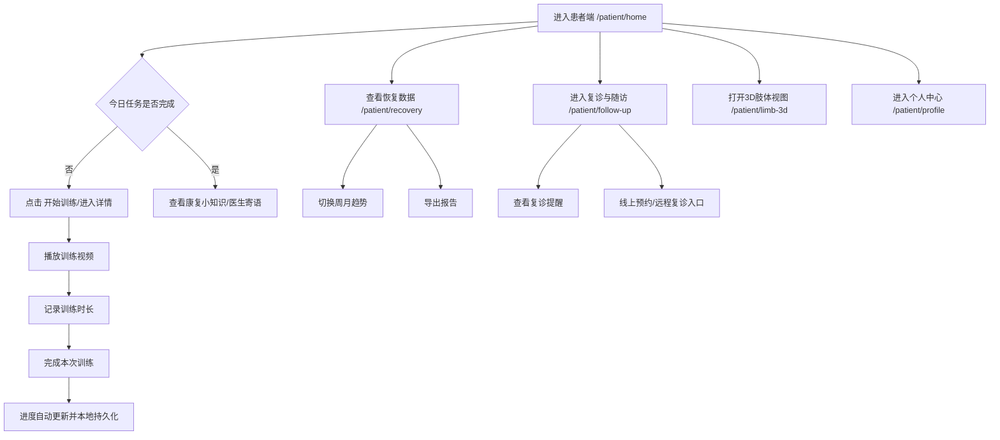

# 患者端产品流程图与方案备选

## 页面与跳转原型（已实现）

- `/patient/home`：康复首页
- `/patient/training`：训练计划页
- `/patient/training/:taskId`：训练详情页（视频 + 时长记录 + 完成训练）
- `/patient/recovery`：恢复数据页（趋势图 + 历史记录 + 导出报告）
- `/patient/follow-up`：复诊与随访页（提醒、预约入口、远程复诊入口）
- `/patient/limb-3d`：3D 肢体视图页
- `/patient/profile`：个人中心页

## 用户操作流程图

## 备选视觉方案（2 套）

### 方案 B：简约清新风

- 主色：`#2F8CFF`
- 辅助：`#EAF5FF`, `#36B37E`, `#FDBA3B`
- 特征：高留白、弱阴影、扁平化图标、信息排布更克制
- 适用：患者教育、家庭康复、低负担阅读场景

### 方案 C：科技感智能康复风

- 主色：`#2F7BFF`
- 深色底：`#0B1F4A`
- 辅助：`#19C37D`, `#F59E0B`
- 特征：深浅分层、数据卡更强可视化、图标偏科技感线性风格
- 适用：强调 AI 评估、智能康复能力展示场景
